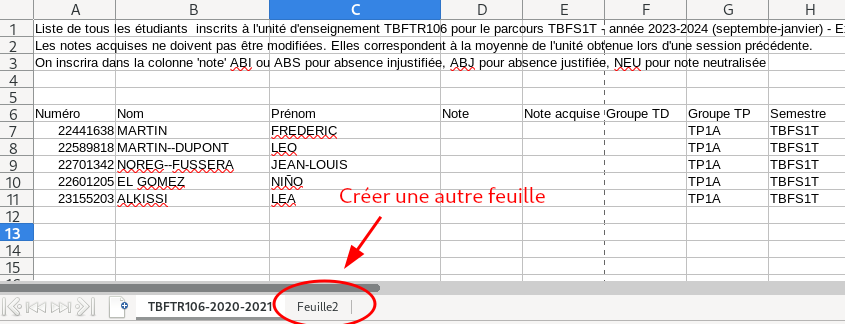
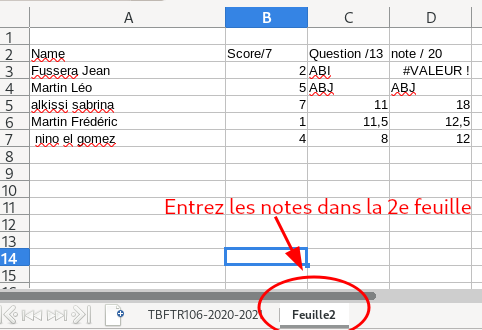
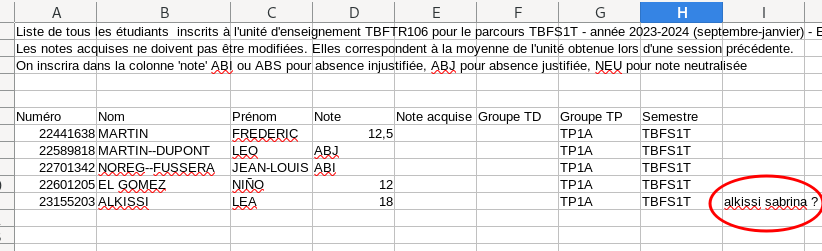

Intracursus Import
==================

## Description
Ce petit programme sert à compléter un fichier ***ODS*** récupéré depuis Intracursus
avec des notes provenant d'une autre feuille de tableur, pour lequel les noms ou prénoms
ne sont pas forcément écrits exactement pareil.

## Installation

    $ git clone https://github.com/wxgeo/intracursus-import.git
    $ cd intracursus-import
    $ pip install -e .

## Utilisation

### Principe
1. Télécharger sur Intracursus le fichier à compléter au format ***ODS*** (*XLS* non supporté).
2. Rajouter un onglet dans le fichier ODS, et y copier les noms des étudiants et les notes.
3. Lancer `import-scores <fichier.ods>`
4. Un fichier `<fichier-merged.ods>` est généré, importable depuis Intracursus.

### Remarques sur les données copiées
* Si elles comportent plusieurs colonnes de nombres, seule la dernière colonne de nombres sera prise en compte.
* Si les identifiants (INE) sont présents, l'import des notes se basera sur ces identifiants. (Les identifiants sont détectés comme une colonne de nombres > 1 000 000).
* Sinon, l'import se basera sur la correspondance des noms. Les données peuvent comporter une seule colonne nom-prénom, ou une colonne nom et une colonne prénom séparées.
  Une correspndance exacte sera d'abord recherché, puis les noms non identifiés le seront pas correspondance partielle.

### Algorithme de fusion des noms complets (prénom + nom)
1. Tous les caractères passent en minuscules.
2. Les caractères accentués sont supprimés (ex: é -> e, ñ -> n, etc.)
3. Le nom est découpé en ensemble de mots selon les espaces ou les tirets.
Ex: `"Jean-Rémi  Rackam--Lerouge"` -> `{"jean", "remi", "rackam", "lerouge"}`
4. On teste la correspondance entre ces ensembles de noms en 3 passes :
   - correspondance exacte entre deux ensemble de mots: A = B,
   - correspondance partielle : A ⊂ B ou B ⊂ A
   - correspondance minimale : A ∩ B ≠ ∅ 
     On ne tient pas compte des mots de taille inférieure ou égale à 2 (Ex: "de").

La dernière passe a un risque non négligeable de faux positifs. 
Par conséquent, on rajoute en fin de ligne dans le fichier fusionné le nom complet
correspondant ayant servi à la fusion, afin de pouvoir vérifier que la correspondance
est correcte.

